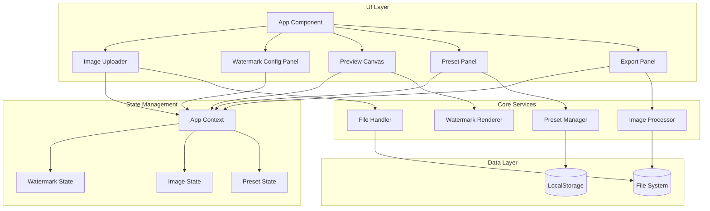

# Design Document: Manga Watermark Tool

## Overview

Manga Watermark Tool adalah aplikasi web berbasis browser yang memungkinkan pengguna menambahkan watermark ke gambar manga/manhwa/manhua. Aplikasi ini dibangun menggunakan teknologi modern web (HTML5 Canvas, TypeScript, React) dan berjalan sepenuhnya di client-side tanpa memerlukan server backend.

### Technology Stack

- **Frontend Framework**: React 18 dengan TypeScript
- **Build Tool**: Vite
- **Styling**: Tailwind CSS
- **Image Processing**: HTML5 Canvas API
- **State Management**: React Context + useReducer
- **File Handling**: File System Access API + JSZip
- **Storage**: LocalStorage untuk presets
- **Testing**: Vitest + fast-check (property-based testing)

### Key Design Decisions

1. **Client-side Processing**: Semua pemrosesan gambar dilakukan di browser untuk privasi dan kecepatan
2. **Canvas-based Rendering**: Menggunakan HTML5 Canvas untuk manipulasi gambar yang efisien
3. **Modular Architecture**: Komponen terpisah untuk watermark, preview, dan export
4. **Preset System**: JSON-based configuration untuk portabilitas

## Architecture



## Components and Interfaces

### Core Interfaces

```typescript
// Watermark Types
interface TextWatermarkConfig {
  type: 'text';
  text: string;
  fontFamily: string;
  fontSize: number;
  fontWeight: 'normal' | 'bold';
  color: string;
  opacity: number;
  outlineEnabled: boolean;
  outlineColor: string;
  outlineWidth: number;
}

interface ImageWatermarkConfig {
  type: 'image';
  imageData: string; // base64
  scale: number;
  opacity: number;
  tileEnabled: boolean;
  tileSpacingX: number;
  tileSpacingY: number;
}

type WatermarkConfig = TextWatermarkConfig | ImageWatermarkConfig;

// Position Types
type PresetPosition = 
  | 'top-left' | 'top-center' | 'top-right'
  | 'middle-left' | 'center' | 'middle-right'
  | 'bottom-left' | 'bottom-center' | 'bottom-right';

interface WatermarkPosition {
  presetPosition: PresetPosition | 'custom';
  offsetX: number;
  offsetY: number;
  rotation: number;
  marginTop: number;
  marginRight: number;
  marginBottom: number;
  marginLeft: number;
}

// Complete Watermark Settings
interface WatermarkSettings {
  config: WatermarkConfig;
  position: WatermarkPosition;
  enabled: boolean;
}

// Preset Types
interface Preset {
  id: string;
  name: string;
  settings: WatermarkSettings;
  createdAt: number;
  updatedAt: number;
}

// Image Types
interface UploadedImage {
  id: string;
  file: File;
  name: string;
  width: number;
  height: number;
  size: number;
  dataUrl: string;
  processed: boolean;
}

// Export Types
type ExportFormat = 'jpg' | 'png' | 'webp';

interface ExportSettings {
  format: ExportFormat;
  quality: number; // 0-100
  filenamePrefix: string;
  filenameSuffix: string;
  preserveOriginalName: boolean;
}

// Processing Types
interface ProcessingResult {
  imageId: string;
  success: boolean;
  error?: string;
  outputBlob?: Blob;
  outputFilename?: string;
}

interface BatchProcessingProgress {
  total: number;
  completed: number;
  failed: number;
  currentImage: string;
  results: ProcessingResult[];
}
```

### Component Specifications

#### 1. ImageUploader Component
- Handles drag & drop and file browser upload
- Validates file types (jpg, png, webp, gif)
- Creates thumbnails for uploaded images
- Emits upload events to parent

#### 2. WatermarkConfigPanel Component
- Tab-based UI for text/image watermark selection
- Text watermark controls: text input, font selector, size slider, color picker, outline toggle
- Image watermark controls: image upload, scale slider, opacity slider, tile toggle
- Position controls: preset position grid, offset inputs, rotation slider, margin inputs

#### 3. PreviewCanvas Component
- Renders selected image with watermark overlay
- Supports zoom (scroll wheel) and pan (drag)
- Draggable watermark positioning
- Toggle watermark visibility

#### 4. PresetPanel Component
- List of saved presets
- Save current settings as new preset
- Load, edit, delete presets
- Import/export presets as JSON

#### 5. ExportPanel Component
- Format selection (JPG, PNG, WEBP)
- Quality slider
- Filename customization
- Apply to single/all images
- Download as ZIP option
- Progress indicator for batch processing

### Service Specifications

#### ImageProcessor Service

```typescript
interface IImageProcessor {
  // Load image from file
  loadImage(file: File): Promise<UploadedImage>;
  
  // Apply watermark to single image
  applyWatermark(
    image: UploadedImage,
    settings: WatermarkSettings
  ): Promise<Blob>;
  
  // Batch process multiple images
  batchProcess(
    images: UploadedImage[],
    settings: WatermarkSettings,
    exportSettings: ExportSettings,
    onProgress: (progress: BatchProcessingProgress) => void
  ): Promise<ProcessingResult[]>;
  
  // Cancel ongoing batch process
  cancelBatch(): void;
  
  // Export single image
  exportImage(
    blob: Blob,
    filename: string,
    format: ExportFormat,
    quality: number
  ): Promise<Blob>;
}
```

#### WatermarkRenderer Service

```typescript
interface IWatermarkRenderer {
  // Render watermark on canvas
  render(
    ctx: CanvasRenderingContext2D,
    settings: WatermarkSettings,
    canvasWidth: number,
    canvasHeight: number
  ): void;
  
  // Calculate watermark bounds
  calculateBounds(
    settings: WatermarkSettings,
    canvasWidth: number,
    canvasHeight: number
  ): { x: number; y: number; width: number; height: number };
  
  // Check if point is within watermark
  hitTest(
    x: number,
    y: number,
    settings: WatermarkSettings,
    canvasWidth: number,
    canvasHeight: number
  ): boolean;
}
```

#### PresetManager Service

```typescript
interface IPresetManager {
  // Get all presets
  getAll(): Preset[];
  
  // Get preset by ID
  getById(id: string): Preset | null;
  
  // Save new preset
  save(name: string, settings: WatermarkSettings): Preset;
  
  // Update existing preset
  update(id: string, updates: Partial<Preset>): Preset;
  
  // Delete preset
  delete(id: string): boolean;
  
  // Export presets to JSON
  exportToJson(): string;
  
  // Import presets from JSON
  importFromJson(json: string): Preset[];
  
  // Serialize settings to JSON
  serialize(settings: WatermarkSettings): string;
  
  // Deserialize settings from JSON
  deserialize(json: string): WatermarkSettings;
}
```

## Data Models

### State Structure

```typescript
interface AppState {
  // Images
  images: UploadedImage[];
  selectedImageId: string | null;
  
  // Watermark
  watermarkSettings: WatermarkSettings;
  
  // Presets
  presets: Preset[];
  selectedPresetId: string | null;
  
  // Export
  exportSettings: ExportSettings;
  
  // UI State
  isProcessing: boolean;
  processingProgress: BatchProcessingProgress | null;
  previewZoom: number;
  previewPan: { x: number; y: number };
  watermarkVisible: boolean;
}
```

### LocalStorage Schema

```typescript
interface StoredData {
  presets: Preset[];
  lastExportSettings: ExportSettings;
  lastWatermarkSettings: WatermarkSettings;
}
```


## Correctness Properties

*A property is a characteristic or behavior that should hold true across all valid executions of a system-essentially, a formal statement about what the system should do. Properties serve as the bridge between human-readable specifications and machine-verifiable correctness guarantees.*

### Property 1: File Format Validation
*For any* file uploaded to the system, the file SHALL be accepted if and only if its extension is one of the supported formats (jpg, jpeg, png, webp, gif), and rejected otherwise with an appropriate error.
**Validates: Requirements 1.3, 1.4**

### Property 2: Image Metadata Extraction
*For any* valid image file, after loading, the extracted metadata (width, height, file size, name) SHALL match the actual properties of the source file.
**Validates: Requirements 1.5**

### Property 3: Text Watermark Configuration Consistency
*For any* text watermark configuration with valid text, font family, font size, and color, the rendered watermark SHALL reflect all specified properties accurately.
**Validates: Requirements 2.1, 2.2, 2.3, 2.4, 2.5**

### Property 4: Opacity Application
*For any* watermark (text or image) with opacity value between 0 and 100, the rendered watermark SHALL have transparency proportional to the specified opacity value.
**Validates: Requirements 2.6, 3.4**

### Property 5: Image Watermark Scaling
*For any* image watermark with scale factor S, the rendered watermark dimensions SHALL equal the original dimensions multiplied by S.
**Validates: Requirements 3.3**

### Property 6: Tiling Calculation
*For any* canvas of size (W, H) and watermark of size (w, h) with tiling enabled and spacing (sx, sy), the number of watermark repetitions SHALL equal ceil(W / (w + sx)) * ceil(H / (h + sy)).
**Validates: Requirements 3.5**

### Property 7: Position Calculation
*For any* preset position and canvas dimensions, the calculated watermark coordinates SHALL place the watermark at the correct location according to the position grid (e.g., 'bottom-right' places watermark at canvas width minus watermark width minus margin).
**Validates: Requirements 4.1, 4.3**

### Property 8: Rotation Application
*For any* rotation angle between 0 and 360 degrees, the watermark SHALL be rotated around its center point by exactly the specified angle.
**Validates: Requirements 4.4**

### Property 9: Margin Constraints
*For any* watermark position with margins specified, the watermark bounds SHALL not extend beyond (margin) pixels from any edge of the canvas.
**Validates: Requirements 4.5**

### Property 10: Preset Save/Load Round-Trip
*For any* valid watermark settings, saving as a preset and then loading that preset SHALL produce settings equivalent to the original.
**Validates: Requirements 5.1, 5.2**

### Property 11: Preset Persistence
*For any* preset saved to storage, after simulated application restart, the preset SHALL be retrievable with all original settings intact.
**Validates: Requirements 5.5**

### Property 12: Preset Export/Import Round-Trip
*For any* collection of presets, exporting to JSON and then importing that JSON SHALL produce a collection equivalent to the original.
**Validates: Requirements 5.6, 5.7**

### Property 13: Batch Processing Completeness
*For any* set of N valid images and watermark settings, batch processing SHALL produce exactly N processed results (success or failure for each).
**Validates: Requirements 6.1**

### Property 14: Batch Error Resilience
*For any* batch containing both valid and invalid images, processing SHALL continue for all images, and the final result count SHALL equal the total input count.
**Validates: Requirements 6.3**

### Property 15: Batch Cancellation Preservation
*For any* batch processing that is cancelled after K images are processed, exactly K results SHALL be preserved and available.
**Validates: Requirements 6.5**

### Property 16: Format Conversion
*For any* image exported with a specified format (jpg, png, webp), the output blob MIME type SHALL match the requested format.
**Validates: Requirements 7.1**

### Property 17: Filename Modification
*For any* export with prefix P and suffix S, the output filename SHALL be P + originalName + S + extension.
**Validates: Requirements 7.4**

### Property 18: ZIP Packaging
*For any* batch export as ZIP containing N images, the ZIP archive SHALL contain exactly N files with correct filenames.
**Validates: Requirements 7.6**

### Property 19: Serialization Round-Trip
*For any* valid WatermarkSettings object, serializing to JSON and deserializing back SHALL produce an object equivalent to the original.
**Validates: Requirements 9.1, 9.2, 9.5**

### Property 20: Serialization Validation
*For any* JSON string that is missing required fields or contains invalid values, deserialization SHALL throw a validation error.
**Validates: Requirements 9.4**

## Error Handling

### Error Categories

1. **File Errors**
   - Invalid file format: Display error toast, reject file
   - File too large: Display warning, suggest compression
   - Corrupted image: Display error, skip in batch processing

2. **Configuration Errors**
   - Invalid watermark text (empty): Disable apply button
   - Invalid opacity/scale values: Clamp to valid range
   - Missing watermark image: Show placeholder

3. **Processing Errors**
   - Canvas rendering failure: Log error, skip image in batch
   - Memory overflow: Reduce batch size, process sequentially
   - Export failure: Retry with fallback format

4. **Storage Errors**
   - LocalStorage full: Warn user, offer to delete old presets
   - Invalid preset JSON: Skip invalid entries, load valid ones

### Error Response Strategy

```typescript
interface ErrorResponse {
  code: string;
  message: string;
  recoverable: boolean;
  suggestedAction?: string;
}

const ErrorCodes = {
  INVALID_FILE_FORMAT: 'E001',
  FILE_TOO_LARGE: 'E002',
  CORRUPTED_IMAGE: 'E003',
  EMPTY_WATERMARK_TEXT: 'E004',
  INVALID_CONFIG_VALUE: 'E005',
  CANVAS_RENDER_FAILED: 'E006',
  MEMORY_OVERFLOW: 'E007',
  EXPORT_FAILED: 'E008',
  STORAGE_FULL: 'E009',
  INVALID_PRESET_JSON: 'E010',
} as const;
```

## Testing Strategy

### Testing Framework

- **Unit Testing**: Vitest
- **Property-Based Testing**: fast-check
- **Component Testing**: React Testing Library
- **E2E Testing**: Playwright (optional)

### Dual Testing Approach

This project uses both unit tests and property-based tests:

1. **Unit Tests**: Verify specific examples, edge cases, and error conditions
2. **Property-Based Tests**: Verify universal properties that should hold across all inputs

Together they provide comprehensive coverage: unit tests catch concrete bugs, property tests verify general correctness.

### Unit Testing Requirements

Unit tests will cover:
- Specific examples demonstrating correct behavior
- Edge cases (empty inputs, boundary values)
- Error conditions and error messages
- Integration points between components

### Property-Based Testing Requirements

- **Library**: fast-check
- **Minimum iterations**: 100 per property test
- **Annotation format**: Each property test MUST include a comment with format: `**Feature: manga-watermark-tool, Property {number}: {property_text}**`

### Test File Structure

```
src/
├── services/
│   ├── ImageProcessor.ts
│   ├── ImageProcessor.test.ts        # Unit tests
│   ├── ImageProcessor.property.test.ts # Property tests
│   ├── PresetManager.ts
│   ├── PresetManager.test.ts
│   ├── PresetManager.property.test.ts
│   ├── WatermarkRenderer.ts
│   ├── WatermarkRenderer.test.ts
│   └── WatermarkRenderer.property.test.ts
├── utils/
│   ├── validation.ts
│   ├── validation.test.ts
│   ├── validation.property.test.ts
│   ├── position.ts
│   ├── position.test.ts
│   └── position.property.test.ts
└── ...
```

### Test Coverage Goals

- Core services: 90%+ coverage
- Utility functions: 100% coverage
- React components: 80%+ coverage (behavior testing)
- All correctness properties: 100% implemented as property tests

