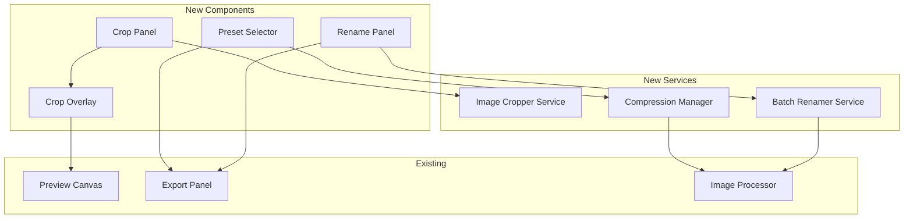

# Design Document: New Features

## Overview

Dokumen ini menjelaskan desain teknis untuk 3 fitur baru:
1. Image Cropping - Crop gambar sebelum watermark
2. Compression Presets - Preset kualitas untuk export
3. Batch Rename - Rename file dengan pattern

## Architecture



## Components and Interfaces

### 1. Image Cropping

```typescript
// Crop Types
interface CropRegion {
  x: number;      // Left position (px)
  y: number;      // Top position (px)
  width: number;  // Width (px)
  height: number; // Height (px)
}

type AspectRatio = '16:9' | '4:3' | '1:1' | '3:4' | '9:16' | 'free';

interface CropSettings {
  enabled: boolean;
  region: CropRegion | null;
  aspectRatio: AspectRatio;
  originalDimensions: { width: number; height: number } | null;
}

// Crop Service Interface
interface IImageCropper {
  // Apply crop to image
  applyCrop(imageData: string, region: CropRegion): Promise<string>;
  
  // Calculate crop region from aspect ratio
  calculateRegionFromAspectRatio(
    canvasWidth: number,
    canvasHeight: number,
    aspectRatio: AspectRatio
  ): CropRegion;
  
  // Validate crop region
  validateRegion(region: CropRegion, imageWidth: number, imageHeight: number): boolean;
}
```

### 2. Compression Presets

```typescript
// Preset Types
type PresetName = 'web' | 'print' | 'archive' | 'custom';

interface CompressionPreset {
  name: PresetName;
  label: string;
  description: string;
  format: ExportFormat;
  quality: number;
  maxWidth: number | null;  // null = original
  maxHeight: number | null; // null = original
  preserveAspectRatio: boolean;
}

// Predefined Presets
const COMPRESSION_PRESETS: Record<PresetName, CompressionPreset> = {
  web: {
    name: 'web',
    label: 'Web',
    description: 'Optimized for web, smaller file size',
    format: 'webp',
    quality: 80,
    maxWidth: 1920,
    maxHeight: null,
    preserveAspectRatio: true,
  },
  print: {
    name: 'print',
    label: 'Print',
    description: 'High quality for printing',
    format: 'png',
    quality: 100,
    maxWidth: null,
    maxHeight: null,
    preserveAspectRatio: true,
  },
  archive: {
    name: 'archive',
    label: 'Archive',
    description: 'Lossless for archival',
    format: 'png',
    quality: 100,
    maxWidth: null,
    maxHeight: null,
    preserveAspectRatio: true,
  },
  custom: {
    name: 'custom',
    label: 'Custom',
    description: 'Manual configuration',
    format: 'jpg',
    quality: 90,
    maxWidth: null,
    maxHeight: null,
    preserveAspectRatio: true,
  },
};

// Compression Manager Interface
interface ICompressionManager {
  getPreset(name: PresetName): CompressionPreset;
  getAllPresets(): CompressionPreset[];
  estimateFileSize(imageSize: number, preset: CompressionPreset): number;
  applyPreset(preset: CompressionPreset, exportSettings: ExportSettings): ExportSettings;
}
```

### 3. Batch Rename

```typescript
// Rename Types
interface RenamePattern {
  pattern: string;  // e.g., "Chapter{chapter}_{page}"
  chapter: string;  // Chapter number/name
  startPage: number; // Starting page number
  padLength: number; // Zero-padding length (e.g., 3 = 001)
}

interface RenameSettings {
  enabled: boolean;
  pattern: RenamePattern;
}

// Available Variables
const PATTERN_VARIABLES = [
  '{chapter}',   // Chapter number
  '{page}',      // Page number (zero-padded)
  '{original}',  // Original filename
  '{date}',      // Current date YYYY-MM-DD
  '{index}',     // Sequential index
] as const;

// Batch Renamer Interface
interface IBatchRenamer {
  // Generate filename from pattern
  generateFilename(
    pattern: RenamePattern,
    originalName: string,
    index: number
  ): string;
  
  // Preview all filenames
  previewFilenames(
    pattern: RenamePattern,
    originalNames: string[]
  ): string[];
  
  // Validate pattern
  validatePattern(pattern: string): { valid: boolean; errors: string[] };
  
  // Ensure unique filenames
  ensureUnique(filenames: string[]): string[];
}
```

## Data Models

### Updated AppState

```typescript
interface AppState {
  // ... existing fields ...
  
  // New: Crop settings
  cropSettings: CropSettings;
  
  // New: Compression preset
  selectedPreset: PresetName;
  
  // New: Rename settings
  renameSettings: RenameSettings;
}
```

### Updated ExportSettings

```typescript
interface ExportSettings {
  // ... existing fields ...
  
  // New: Preset reference
  preset: PresetName;
  
  // New: Resize options
  maxWidth: number | null;
  maxHeight: number | null;
  preserveAspectRatio: boolean;
  
  // New: Rename pattern
  renameEnabled: boolean;
  renamePattern: RenamePattern;
}
```

## Implementation Details

### Image Cropping Flow

1. User clicks "Enable Crop" button
2. Crop overlay appears on preview canvas
3. User drags handles or enters dimensions
4. Preview updates in real-time
5. User clicks "Apply Crop"
6. Image is cropped and stored
7. Watermark position recalculated

### Compression Preset Flow

1. User opens Export panel
2. Preset buttons displayed (Web, Print, Archive, Custom)
3. User selects preset
4. Export settings auto-configured
5. Estimated file size shown
6. User exports with preset settings

### Batch Rename Flow

1. User enables "Batch Rename" toggle
2. Pattern input field appears
3. User enters pattern with variables
4. Preview shows resulting filenames
5. On export, filenames generated from pattern

## Error Handling

### Crop Errors
- Invalid region (outside bounds): Clamp to image bounds
- Zero dimension: Reject with error message

### Compression Errors
- Resize failure: Fall back to original dimensions
- Format not supported: Fall back to PNG

### Rename Errors
- Invalid pattern: Show validation error
- Duplicate filenames: Auto-append suffix

## Testing Strategy

Property-based tests akan ditambahkan untuk:
1. Crop region validation
2. Pattern variable replacement
3. Filename uniqueness
4. Preset application

